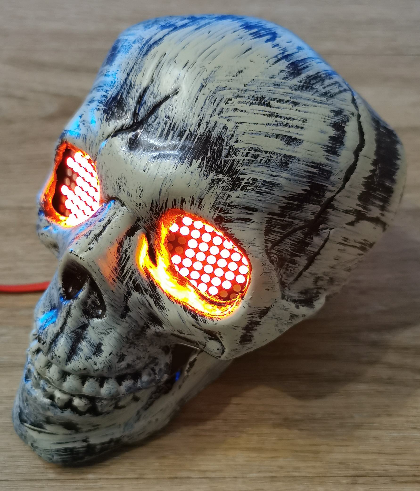

# 🎃 HalloweenSkull - Animated Skull with Googly Eyes 👁️

An ESP32-powered animated skull featuring expressive googly eyes using 8x8 LED matrices and spooky sound effects. Perfect for creating an immersive, interactive Halloween decoration that watches and talks to visitors!

<p align="center">
    
</p>

## 📖 Overview

**HalloweenSkull** brings a decorative skeleton to life with:
- 👀 **Animated LED matrix eyes** with smooth, realistic movements
- 🔊 **Sound effects** including spooky phrases, yawns, and atmospheric sounds
- 🤖 **Autonomous behavior** - the skull randomly looks around, blinks, and speaks
- 🛠️ **Custom 3D-printed mounts** to secure components inside the skull

The project combines hardware, firmware, and mechanical design to create an engaging Halloween decoration that captivates viewers.

👉 **See the README in each folder for detailed component documentation.**

## 🛠️ Hardware Requirements

### Components

- **ESP32 Development Board** (e.g., AZ-Delivery DevKit v4)
- **2x MAX7219 8x8 LED Dot Matrix Modules** (daisy-chained)
- **DFPlayer Mini MP3 Player Module** with microSD card
- **Speaker** (8Ω recommended, connected to DFPlayer)
- **MicroSD Card** (for audio files, FAT32 format)
- **Base Skull**: [5 Pcs Halloween Skeleton Head and Arm Set](https://www.amazon.fr/dp/B0FBW7PP8G)
- **3D Printed Mounts** (STL files in `mechanical/` folder)
- **Power Supply**: 5V, 2A+ recommended
- **Screws and basic hardware** for assembly

### Pin Connections

#### LED Matrices (SPI)
| ESP32 Pin | MAX7219 Pin | Description       |
| --------- | ----------- | ----------------- |
| GPIO 18   | CLK         | Clock signal      |
| GPIO 23   | DIN         | Data input (MOSI) |
| GPIO 5    | CS          | Chip select       |
| 5V        | VCC         | Power supply      |
| GND       | GND         | Ground            |

#### DFPlayer Mini (UART)
| ESP32 Pin | DFPlayer Pin | Description |
| --------- | ------------ | ----------- |
| GPIO 17   | RX           | ESP32 TX2   |
| GPIO 16   | TX           | ESP32 RX2   |
| 5V        | VCC          | Power       |
| GND       | GND          | Ground      |

> 💡 The two MAX7219 modules are daisy-chained: Device 0 = Right eye, Device 1 = Left eye

## ✨ Features

### 👁️ Eye Animations
- **Googly eyes** with movable 2x2 pixel irises
- **Smooth interpolated movement** between positions
- **Multiple positions**: center, top, bottom, left, right, diagonals
- **Blinking/closing** animation with configurable probability
- **Adjustable brightness** (0-15)

### 🔊 Sound Effects
Three types of sounds played randomly:
- **Speech sounds** (folder 01) - Spooky phrases and words
- **Yawning sounds** (folder 02) - Triggered when eyes close
- **Effect sounds** (folder 03) - Atmospheric horror effects

Sounds are timed with configurable delays for unpredictable, natural behavior.

### 🎛️ Customization
All behavior is configurable via `firmware/src/config.h`:
- Animation timing and delays
- Eye brightness
- Sound volume and folder assignments
- Blink probability

## 🚀 Getting Started

### 1️⃣ Prepare the SD Card

1. Format a microSD card as **FAT32**
2. Copy the `sounds/` folder structure to the SD card root:
   ```
   SD Card Root/
   ├── 01/  (Speech sounds - 001.mp3, 002.mp3, ...)
   ├── 02/  (Yawning sounds)
   └── 03/  (Effect sounds - YOU MUST ADD THESE)
   ```
3. **Important**: The `03/` folder is empty by default due to licensing. Download your own sound effects from [Pixabay](https://pixabay.com/sound-effects/), [Freesound.org](https://freesound.org/), or similar sites.
4. Name files as `001.mp3`, `002.mp3`, etc. in MP3 format
5. Update `firmware/src/config.h` to match the number of files you added:
   ```cpp
   #define DFPLAYER_CONFIG { \
       .effectNbSounds = 6  // Change this to your file count
   }
   ```

### 2️⃣ 3D Print the Mounts

1. Open `mechanical/Mounts.FCStd` in FreeCAD, or use the exported STL files
2. Print the 3 parts:
   - **SupportLED**: Holds the two LED matrices
   - **HolderTop**: Upper arm part, screws to the skull
   - **HolderBottom**: Lower arm part, screws to SupportLED
3. See [`mechanical/README.md`](mechanical/README.md) for assembly details

### 3️⃣ Build and Upload Firmware

1. **Install PlatformIO** (VS Code extension recommended)
2. **Clone the repository**:
   ```bash
   git clone https://github.com/TehoorMarjan/HalloweenSkull.git
   cd HalloweenSkull/firmware
   ```
3. **Configure** (optional): Edit `src/config.h` for pin changes or customization
4. **Build and upload**:
   ```bash
   pio run --target upload
   ```
5. **Monitor** (optional):
   ```bash
   pio device monitor
   ```

See [`firmware/README.md`](firmware/README.md) for detailed firmware documentation.

### 4️⃣ Hardware Assembly

1. **Mount LED matrices** to the SupportLED using screws
2. **Attach the holder arms** creating an adjustable articulation
3. **Position inside skull**: Screw HolderTop inside the skull's "mouth"
4. **Connect electronics**: Wire ESP32 to LED matrices and DFPlayer
5. **Insert SD card** into DFPlayer Mini
6. **Power up** and test!
7. **Adjust positioning** using the articulated holder
8. **Close the skull** and enjoy your creation!

## 🐛 Troubleshooting

**Eyes don't light up:**
- Check SPI wiring (CLK, DATA, CS pins)
- Verify hardware type matches your LED modules
- Try increasing brightness in firmware config

**No sound:**
- Ensure SD card is FAT32 formatted
- Check UART connections (RX/TX are crossed!)
- Verify audio files follow naming convention (001.mp3, 002.mp3...)
- Update sound file count in firmware config to match your files

**Erratic behavior:**
- Use adequate power supply (2A+ recommended)
- Check all ground connections

> 💡 **See component-specific READMEs for detailed troubleshooting and configuration.**

## 🎨 Customization Ideas

- Add motion sensor to trigger reactions when people approach
- Implement WiFi control for remote triggering
- Add more eye animation modes (cross-eyed, silly)
- Synchronize with other Halloween props
- Add LED strip lighting effects
- Create themed sound sequences for different scenarios

## 📚 Documentation

- **[Firmware README](firmware/README.md)** - Detailed firmware documentation, API reference
- **[Mechanical README](mechanical/README.md)** - 3D models, assembly instructions, photos
- **[Sound Effects Guide](sounds/03/README)** - How to find and prepare audio files

## 🤝 Contributing

Contributions are welcome! Feel free to:
- 🐛 Report bugs via GitHub issues
- 💡 Suggest new features or improvements
- 🔧 Submit pull requests
- 📸 Share photos of your build
- 🎵 Contribute sound effect recommendations

Please ensure your code follows the existing style and includes appropriate documentation.


## � License

This project is licensed under the MIT License - see the [LICENSE](LICENSE) file for details.

### Third-Party Content

- **MAX7219 LED Matrix 3D Model**: By FabroLabs Technologies ([GrabCAD](https://grabcad.com/library/max7219-8x8-led-dot-matrix-display-module-1))
- **Sound Effects**: Not included - users must provide their own from free sources like Pixabay, Freesound.org, etc.

## 🙏 Acknowledgments

- MD_MAX72XX library by MajicDesigns
- DFRobotDFPlayerMini library
- PlatformIO and Arduino communities
- All the amazing free sound effect libraries

## 💀 Happy Halloween! 🎃👻

---

*Built with ❤️ for Halloween 2025 - May your decorations be spooky and your code bug-free!*

**⭐ If you build this project, please star the repo and share photos of your creation!**
