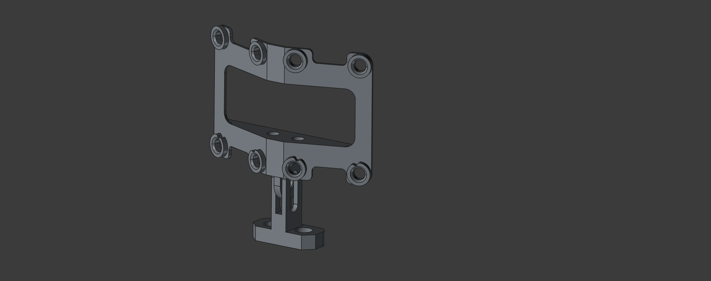
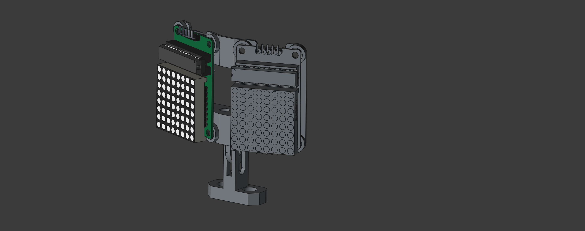

# 🎃 HalloweenSkull Mechanical Components 🦴

Welcome to the mechanical folder for the **HalloweenSkull** project! Here you'll
find all the 3D models, CAD files, and documentation needed to build and
customize the mechanical parts of your animated skull.

## 🛠️ Mounts

- **File:** `Mounts.FCStd`
- **Description:** FreeCAD design for the mounts. The mount is split into 3
  bodies for easier print, assembly, and tweaking:
  - **SupportLED:** Holds the two LED matrices (with MAX7219 boards), which are
    screwed onto it.
  - **Holder (2 parts):** A two-part arm linking the support to the plastic
    skull. One part is screwed inside the skull's "mouth", the other to the
    support. The articulation between them allows for position adjustment within
    the skull.

	
	

## MAX7219 8x8 LED Dot Matrix Display Module

- **File:** `MAX7219 8x8 LED Dot Matrix Display Module.STEP`
- **Description:** 3D model of the LED matrix display used for the eyes.
- **License:** See
  [`MAX7219 8x8 LED Dot Matrix Display Module.STEP.LICENSE`](MAX7219%208x8%20LED%20Dot%20Matrix%20Display%20Module.STEP.LICENSE)
  for third-party info. Model by FabroLabs Technologies
  ([GrabCAD link](https://grabcad.com/library/max7219-8x8-led-dot-matrix-display-module-1)).
